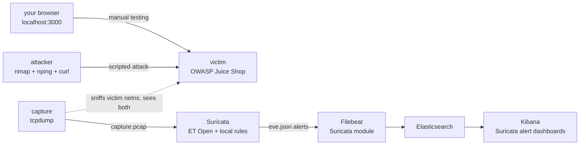

# mini-soc-lab

A small, reproducible SOC lab built entirely from the **real open-source tools
security teams run in production** — no hand-rolled detection engine. One
`make demo` spins up a vulnerable target, attacks it with real tooling,
captures the traffic, runs it through an industry-standard IDS, and lands
the alerts in a real SIEM dashboard.

This is deliberately the opposite of "build your own mini-Snort in Flask":
the point is fluency with the actual stack a SOC analyst / detection
engineer touches day one on the job.

## Architecture



`capture` sniffs on the **victim's** own network interface, not the
attacker's — so it sees everything that reaches Juice Shop, including
anything you do by hand at http://localhost:3000, not just the scripted
attack. Try the classic SQLi login bypass yourself: email `' OR 1=1--`,
any password — it logs you in as `admin@juice-sh.op` with zero real
credentials, and (after `make capture-stop analyze`) shows up as a real
Suricata alert. One caveat: the port-scan rule just counts SYN packets per
source in a window, not distinct ports, so normal browser page-loads
(which open several parallel connections) can occasionally trip it too —
a small, realistic taste of tuning threshold rules in real SOC work.

## Try it online — no install

Don't want to install Docker locally? Run the whole thing for free on
[Play with Docker](https://labs.play-with-docker.com/) — a disposable Linux
box with Docker pre-installed, live in your browser. Sign in with a free
Docker Hub account, click **+ ADD NEW INSTANCE**, then paste:

```bash
apk add --no-cache git make
git clone https://github.com/Dc0der-X/mini-soc-lab.git
cd mini-soc-lab
make demo
```

Play with Docker auto-detects listening ports and shows clickable badges at
the top of the screen — click **3000** for Juice Shop and **5601** for
Kibana. Sessions last 4 hours, then the whole box is destroyed — spin up a
fresh one anytime, free, forever. See the [landing page](site/index.html)
for a friendlier walkthrough of the same steps.

## Tools used (all open source — click through)

| Layer | Tool | Link |
|---|---|---|
| Detection engine | Suricata (IDS/IPS/NSM) | https://suricata.io/ |
| Detection ruleset | Emerging Threats Open | https://rules.emergingthreats.net/ |
| Packet capture | tcpdump | https://www.tcpdump.org/ |
| Attack tooling | nmap (scan + nping for flood) | https://nmap.org/ |
| Vulnerable target | OWASP Juice Shop | https://owasp.org/www-project-juice-shop/ |
| Log shipping | Filebeat (Suricata module) | https://www.elastic.co/guide/en/beats/filebeat/current/filebeat-module-suricata.html |
| SIEM / search | Elasticsearch | https://www.elastic.co/elasticsearch |
| SIEM / dashboards | Kibana | https://www.elastic.co/kibana |
| Orchestration | Docker Compose | https://docs.docker.com/compose/ |

## What it detects

Signature-based (Suricata + ET Open + [local.rules](suricata/rules/local.rules)):
- SQL injection (`UNION SELECT`, `' OR 1=1`)
- Reflected XSS (`<script>`, `onerror=`)
- Directory traversal (`../../`)
- Command injection (`; cat /etc/passwd`, `$(...)`)

Behavioral (threshold rules, same thresholds as classic SOC playbooks):
- Port scan — 6+ ports from one source within 5 seconds
- SYN flood / DoS — 30+ SYNs to one destination within 2 seconds

## Prerequisites (running locally)

You need `docker` and `docker compose` (v2, the `docker compose` subcommand —
not the old standalone `docker-compose`) on your `PATH`. Pick your OS below,
or skip this entirely with the no-install option above.

<details>
<summary><b>macOS</b></summary>

Install [Docker Desktop](https://docs.docker.com/desktop/setup/install/mac-install/)
(Apple Silicon or Intel build, whichever matches your Mac). Launch it once
from Applications — first launch registers the `docker` CLI, which can take
30–60 seconds. Verify:

```bash
docker --version && docker compose version
```
</details>

<details>
<summary><b>Windows</b></summary>

Install [Docker Desktop for Windows](https://docs.docker.com/desktop/setup/install/windows-install/)
with the **WSL2 backend** (the installer defaults to this and will prompt to
enable WSL2 if it isn't already). Then pick one:

- **Recommended — run everything from a WSL2 terminal** (Ubuntu, via Windows
  Terminal or `wsl`): behaves identically to Linux below, including `make`.
  ```bash
  sudo apt update && sudo apt install -y make git
  ```
- **Native PowerShell**: `docker` and `docker compose` work fine, but `make`
  isn't available by default. Use the make-free command reference further
  down instead of `make demo`.

Verify from either shell:
```powershell
docker --version
docker compose version
```
</details>

<details>
<summary><b>Linux</b></summary>

Install Docker Engine + the Compose plugin via the
[official instructions](https://docs.docker.com/engine/install/) for your
distribution, or the quick convenience script (fine for a lab machine, not
recommended for anything production):

```bash
curl -fsSL https://get.docker.com | sudo sh
sudo usermod -aG docker $USER   # then log out/in, or `newgrp docker`
sudo apt install -y make git    # Debian/Ubuntu — use dnf/pacman/etc on other distros
```

Verify:
```bash
docker --version && docker compose version
```
</details>

## Run it

```bash
cd ~/mini-soc-lab
make demo
```

This will: build the attacker image, start Juice Shop, wait for it to be
ready, run the attack simulation, stop the packet capture, run Suricata
against the resulting pcap, and start Elasticsearch/Kibana/Filebeat.

Then open:
- **Kibana** → http://localhost:5601 → *Analytics ▸ Dashboards* → search
  "Suricata" for the pre-built alert dashboards (Filebeat's Suricata module
  loads these automatically, no manual dashboard-building). If a panel looks
  empty, widen the time picker (top right, defaults to "Last 15 minutes") —
  it needs to cover whenever `make attack` actually ran.
- **Raw alerts** → [`suricata/logs/eve.json`](suricata/logs/eve.json) (JSON,
  one alert per line) or `suricata/logs/fast.log` (human-readable).

To re-run just the attack + analysis (SIEM already up):
```bash
make attack capture-stop analyze
```

To also point Suricata at a third-party PCAP (e.g. from
https://www.malware-traffic-analysis.net/) instead of the simulated traffic,
drop it in `pcaps/capture.pcap` and run `make analyze` directly.

Tear down:
```bash
make down      # stop containers, keep captured data
make clean     # stop containers, wipe pcaps/logs/ES volume
```

### No `make`? Run the exact same steps by hand

Every Makefile target is a thin wrapper around plain `docker compose`. If
you're on native Windows PowerShell/CMD, or any environment without `make`,
run these directly — line for line, this *is* `make demo`:

```bash
# 1. build attacker image, start victim + attacker + capture
docker compose --profile lab up -d --build victim attacker capture

# 2. wait for Juice Shop to answer
docker compose exec -T attacker sh -c "until curl -s -o /dev/null http://victim:3000; do sleep 2; done"

# 3. run the attack simulation
docker compose exec -T attacker /attacks/simulate_attacks.sh

# 4. stop the capture, flushing the pcap
docker compose stop capture

# 5. run Suricata against the captured traffic
docker compose --profile analyze run --rm suricata

# 6. bring up the SIEM
docker compose --profile siem up -d elasticsearch kibana filebeat
```

Reference table for every other Makefile target:

| `make` target | Equivalent command |
|---|---|
| `make lab-up` | `docker compose --profile lab up -d --build victim attacker capture` |
| `make attack` | `docker compose exec -T attacker /attacks/simulate_attacks.sh` |
| `make capture-stop` | `docker compose stop capture` |
| `make analyze` | `docker compose --profile analyze run --rm suricata` |
| `make siem-up` | `docker compose --profile siem up -d elasticsearch kibana filebeat` |
| `make down` | `docker compose --profile lab --profile siem --profile analyze down` |
| `make clean` | `make down` + `rm -f pcaps/*.pcap suricata/logs/*.json suricata/logs/*.log` + `docker compose --profile siem down -v` |

## Practice checklist — first time running this

A concrete sequence for a first pass, start to finish:

1. Confirm prerequisites above, then `cd ~/mini-soc-lab && make demo` (or the
   no-`make` block above). First run takes 3–6 minutes pulling images.
2. Open Kibana (http://localhost:5601) → *Analytics ▸ Dashboards* → search
   "Suricata" → open **[Filebeat Suricata] Alert Overview**.
3. Widen the time picker to "Last 24 hours" if panels look empty.
4. Open `attacker/simulate_attacks.sh` and `suricata/rules/local.rules` side
   by side — match each payload to the rule (SID) that catches it.
5. Re-run just the attack: `make attack capture-stop analyze`, then refresh
   Kibana and watch the alert counts change.
6. Try `make clean`, then `make demo` again from scratch to confirm the
   whole pipeline is reproducible, not a one-off fluke.
7. Optional stretch goal: drop a real malware pcap from
   [malware-traffic-analysis.net](https://www.malware-traffic-analysis.net/)
   into `pcaps/capture.pcap` and run `make analyze` directly — see what a
   production ruleset catches on real-world traffic.

## Why real tools instead of a custom engine

A hand-built Flask+Scapy detector is a fine exercise in networking
fundamentals, but it doesn't transfer directly to a SOC seat — the job is
tuning Suricata rules, reading `eve.json`, and building Kibana dashboards on
top of the Elastic stack (or the Wazuh/Splunk/Sentinel equivalents). This
lab is built so every command in it is something you'd actually run in a
detection-engineering role, and every tool has a public project you can
keep learning from after this repo.
