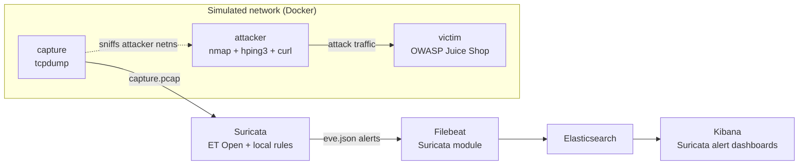

# mini-soc-lab

A small, reproducible SOC lab built entirely from the **real open-source tools
security teams run in production** — no hand-rolled detection engine. One
`make demo` spins up a vulnerable target, attacks it with real tooling,
captures the traffic, runs it through an industry-standard IDS, and lands
the alerts in a real SIEM dashboard.

This is deliberately the opposite of "build your own mini-Snort in Flask":
the point is fluency with the actual stack a SOC analyst / detection
engineer touches day one on the job.

## Architecture



## Tools used (all open source — click through)

| Layer | Tool | Link |
|---|---|---|
| Detection engine | Suricata (IDS/IPS/NSM) | https://suricata.io/ |
| Detection ruleset | Emerging Threats Open | https://rules.emergingthreats.net/ |
| Packet capture | tcpdump | https://www.tcpdump.org/ |
| Attack tooling | nmap | https://nmap.org/ |
| Attack tooling | hping3 | http://www.hping.org/ |
| Vulnerable target | OWASP Juice Shop | https://owasp.org/www-project-juice-shop/ |
| Log shipping | Filebeat (Suricata module) | https://www.elastic.co/guide/en/beats/filebeat/current/filebeat-module-suricata.html |
| SIEM / search | Elasticsearch | https://www.elastic.co/elasticsearch |
| SIEM / dashboards | Kibana | https://www.elastic.co/kibana |
| Orchestration | Docker Compose | https://docs.docker.com/compose/ |

## What it detects

Signature-based (Suricata + ET Open + [local.rules](suricata/rules/local.rules)):
- SQL injection (`UNION SELECT`, `' OR 1=1`)
- Reflected XSS (`<script>`, `onerror=`)
- Directory traversal (`../../`)
- Command injection (`; cat /etc/passwd`, `$(...)`)

Behavioral (threshold rules, same thresholds as classic SOC playbooks):
- Port scan — 6+ ports from one source within 5 seconds
- SYN flood / DoS — 30+ SYNs to one destination within 2 seconds

## Prerequisites

**Docker Desktop is not currently installed on this machine.** Install it
first: https://docs.docker.com/desktop/setup/install/mac-install/
(Apple Silicon or Intel build, whichever matches your Mac). Everything below
assumes `docker` and `docker compose` are on your `PATH`.

## Run it

```bash
cd ~/mini-soc-lab
make demo
```

This will: build the attacker image, start Juice Shop, wait for it to be
ready, run the attack simulation, stop the packet capture, run Suricata
against the resulting pcap, and start Elasticsearch/Kibana/Filebeat.

Then open:
- **Kibana** → http://localhost:5601 → *Analytics ▸ Dashboards* → search
  "Suricata" for the pre-built alert dashboards (Filebeat's Suricata module
  loads these automatically, no manual dashboard-building).
- **Raw alerts** → [`suricata/logs/eve.json`](suricata/logs/eve.json) (JSON,
  one alert per line) or `suricata/logs/fast.log` (human-readable).

To re-run just the attack + analysis (SIEM already up):
```bash
make attack capture-stop analyze
```

To also point Suricata at a third-party PCAP (e.g. from
https://www.malware-traffic-analysis.net/) instead of the simulated traffic,
drop it in `pcaps/capture.pcap` and run `make analyze` directly.

Tear down:
```bash
make down      # stop containers, keep captured data
make clean     # stop containers, wipe pcaps/logs/ES volume
```

## Why real tools instead of a custom engine

A hand-built Flask+Scapy detector is a fine exercise in networking
fundamentals, but it doesn't transfer directly to a SOC seat — the job is
tuning Suricata rules, reading `eve.json`, and building Kibana dashboards on
top of the Elastic stack (or the Wazuh/Splunk/Sentinel equivalents). This
lab is built so every command in it is something you'd actually run in a
detection-engineering role, and every tool has a public project you can
keep learning from after this repo.
